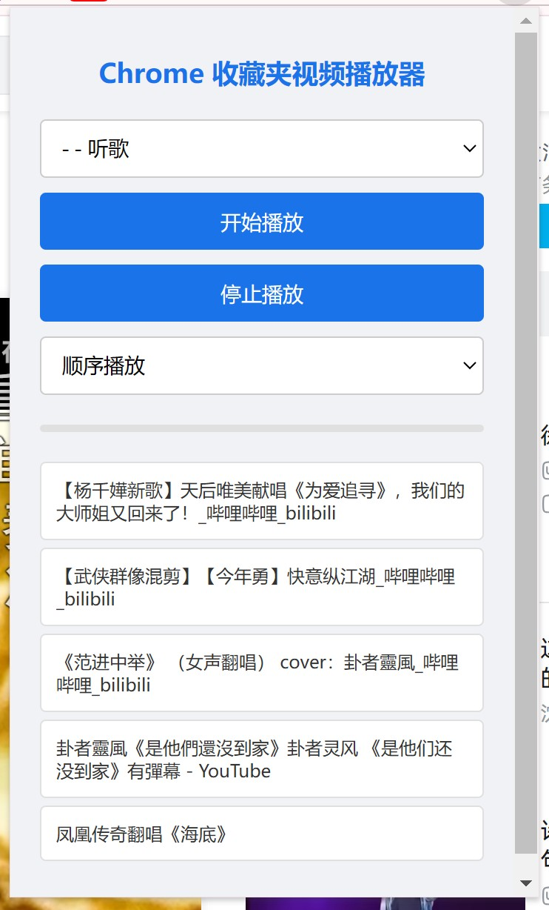

# Chrome 收藏夹视频播放器

## 项目初衷

各大音乐软件需要专门的app，开了会员很多歌也听不到，私人上传的歌曲也不好找。相比之下，视频软件既能听到很全的歌，又不收费。但是跨视频网站播放不方便，于是就有了这个扩展。

## 简介

这是一个 Chrome 扩展，可以让您方便地播放收藏夹中的视频，就像使用音乐播放器一样。

## 界面预览

## 功能介绍

1. **选择收藏夹**：在顶部有一个下拉菜单，用于选择要播放的收藏夹。默认选中"听歌"文件夹（如果存在）。

2. **完整播放控制**：包含播放/暂停、上一首、下一首和停止播放按钮，方便控制播放流程。

3. **播放模式**：您可以选择"顺序播放"或"随机播放"模式。默认为随机播放。

4. **进度条**：显示当前播放视频的进度，并且可以点击跳转到指定位置。

5. **视频列表**：在扩展底部显示当前选中收藏夹中的所有视频。点击列表中的任何视频可以从该视频开始播放。

6. **播放速度控制**：可调整视频播放速度，从0.5x到2.0x不等。

7. **记忆播放位置**：可以记住每个视频的播放位置，下次播放时自动从上次位置继续。

8. **推荐视频支持**：当你从当前视频点击感兴趣的推荐视频时，看完后可以自动回到原播放列表继续播放。

9. **自动连续播放**：一个视频播放结束后，会自动播放下一个视频，无需手动操作。

## 使用方法

1. 点击 Chrome 工具栏中的扩展图标打开扩展界面。

2. 从下拉菜单中选择想要播放的收藏夹（默认为"听歌"文件夹，如果存在）。

3. 选择播放模式（顺序或随机）。

4. 点击"开始播放列表"按钮，或直接点击列表中的某个视频开始播放。

5. 使用播放控制按钮（上一首、播放/暂停、下一首）控制播放。

6. 如果要完全停止播放，点击停止按钮即可。

7. 可以调整播放速度或点击进度条跳转到特定位置。

享受您的听歌之旅！

## 安装说明

由于这是一个未上架的 Chrome 扩展，您需要按照以下步骤在开发者模式下安装：

1. 下载扩展文件并解压到本地文件夹。

2. 打开 Chrome 浏览器，在地址栏输入 `chrome://extensions/` 并回车。

3. 在右上角找到"开发者模式"开关，并打开它。

4. 点击左上角出现的"加载已解压的扩展程序"按钮。

5. 在弹出的文件选择器中，选择您解压扩展文件的文件夹。

6. 扩展程序应该已经成功加载，您可以在 Chrome 工具栏看到扩展图标。

7. 点击扩展图标即可开始使用。

注意：由于这是开发者模式安装的扩展，每次重启 Chrome 时可能会提示您确认是否继续使用该扩展。这是正常的安全提示，您可以选择继续使用。

## 版本历史

### v1.4.6
- 添加独立播放器按钮，打开沉浸式听歌界面
- 明确了全屏按钮的功能说明，更新按钮提示文字
- 优化按钮布局和样式

### v1.4.5
- 简化全屏功能，改为直接在新标签页打开视频
- 解决全屏功能无法使用的问题
- 提升全屏功能的可靠性和兼容性

### v1.4.4
- 修复全屏功能，改进全屏交互方式
- 移除"播放列表"标题文字，增加视频列表显示空间
- 调整列表区域上边距，优化整体布局
- 添加未来展望部分，规划后续功能开发方向

### v1.4.3
- 将黑色主题改为浅色主题，提供更友好的视觉体验
- 修复全屏功能，使用网站原生全屏按钮或HTML5全屏API
- 改进视觉对比度和按钮交互效果
- 优化了列表项的样式和指示器颜色

### v1.4.2
- 移除"自动播放下一个视频"设置选项
- 默认自动连续播放视频，简化用户体验
- 删除设置区域，使界面更简洁
- 优化视频播放逻辑

### v1.4.1
- 将界面宽度从360px增加到720px，提供更宽敞的用户体验
- 最大高度从500px增加到600px (Chrome扩展允许的最大高度)
- 控制栏改为左对齐布局，功能按钮靠右显示
- 调整了元素间距和内边距，优化界面布局
- 增加了视频列表的最大高度，可显示更多视频
- 改进了视频列表项的样式和播放指示器
- 扩大了下拉菜单宽度，提升可用性
- 优化了进度条和设置区域样式
- 采用黑色系主题(#121212、#181818、#212121等深色)，提供更好的视觉体验

### v1.4
- 将所有控制元素整合在同一行，更高效利用空间
- 增加播放列表高度到350px，显示更多内容
- 减小各区域边距，优化整体空间利用
- 调整控制按钮大小和样式，提高视觉一致性
- 优化布局以在有限高度下显示更多内容

### v1.3
- 优化UI布局，将控制按钮放在同一行
- 移除标题节省空间
- 修复播放列表显示问题
- 顶部配置、中间控制、底部列表的三段式布局
- 调整按钮尺寸和位置，更符合用户习惯

### v1.2
- 增加了标准播放控制按钮（上一首、播放/暂停、下一首）
- 界面宽度加宽，适应长标题显示
- 视频列表高度增加，可显示更多内容
- 点击进度条可跳转到指定位置
- 当前播放项自动滚动到可视区域
- 默认随机播放模式
- 播放/暂停状态可视化显示

### v1.1
- 添加播放速度控制功能
- 增加视频播放时间显示
- 添加记忆播放位置功能
- 优化视频推荐功能，支持点击推荐视频后返回播放列表
- 美化用户界面
- 优化播放性能

### v1.0
- 初始版本发布
- 支持从Chrome收藏夹播放视频
- 基本的播放控制功能
- 支持B站和YouTube视频

## 未来展望

计划在未来版本中添加的功能：

1. **背景颜色主题设置**：允许用户选择浅色/深色主题或自定义颜色
2. **定时自动停止播放**：设置计时器在指定时间后自动停止播放
3. **键盘快捷键支持**：添加键盘快捷键控制播放
4. **本地播放历史记录**：记录播放历史，方便回顾
5. **统计分析功能**：显示播放时长、频率等统计信息
6. **平滑过渡效果**：改进UI动画和过渡效果

如果您有其他功能建议，欢迎提出！
